## Abstract 

In this applcation users can create appointments for electric car charging stations at available time and date. Users are able to search by cities and filter information by socket, charger, distance and facility service information.

Applcations features are:

✅ MVVM + Coordinator
✅ Custom Font
✅ Custom Color Pallet
✅ English and Turkish Localization
✅ RestAPI CRUD methods
✅ Regex

Note: Commit after the deadline was for the README file. Only missing feature in the app is reminder notification.

## Method 

Data processing and displaying handled by MVVM, routing handled by Coordinator pattern. Applications navigation hiarchy displayed in the image.

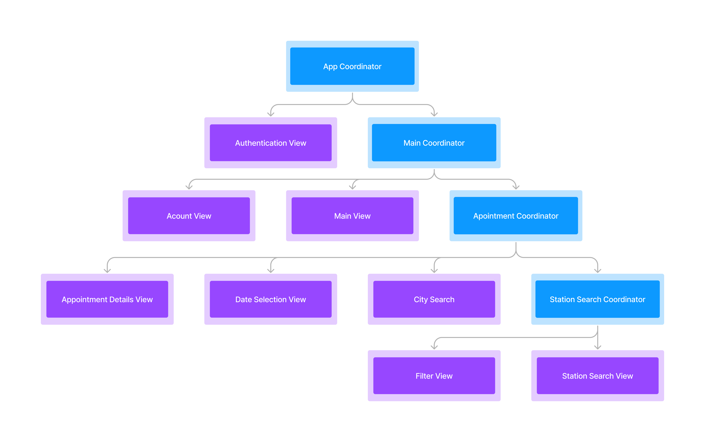

App Coordinator handles routing between Authenticaton and Main Coordinator. Main Coordintor routes core view of the application. Appointment Coordinator routes views that handles appointment creation. Station Search Cooridinator, handles routing of listing view and it's corresponding filter view.

### Authentication View

In this view user e-mail and device ID is posted to backend and fetches token for API calls. E-mail input from user is in regex control and if user enters email in wrong format there is a warning displayed.

  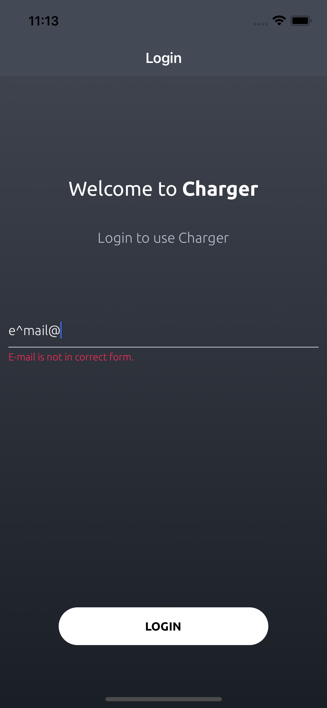 

### Appointed Stations View

Past and Future appointments of user are displayed in this view. Server returns a JSON data that stores station and due of appointment thus appointments catogorzied by there due information. Station information stored on a custom table cell view. Users can tap on a cell and delete there future appointments, before deletion of appointment a warning message is displayed. Users have maximum limit of 3 appointments, appointment limit controlled by number of future appointments. If user haven't made any appointments a messaged displayed on screen. Users can select acount icon on navigation bar then log out or see their information on Account View.

  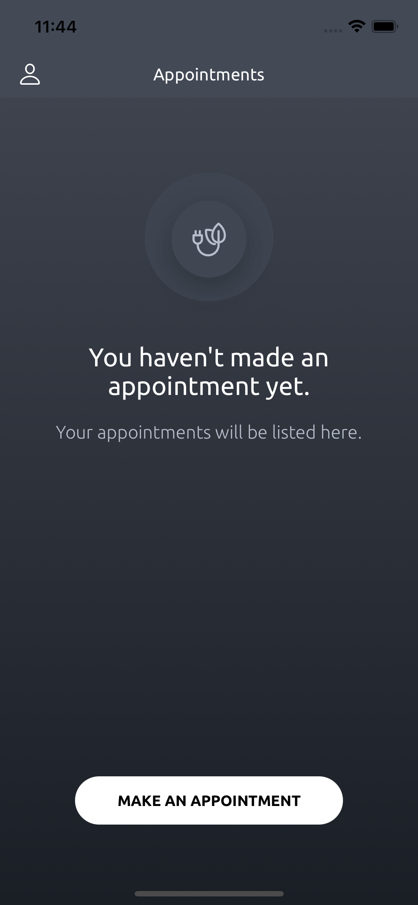 
   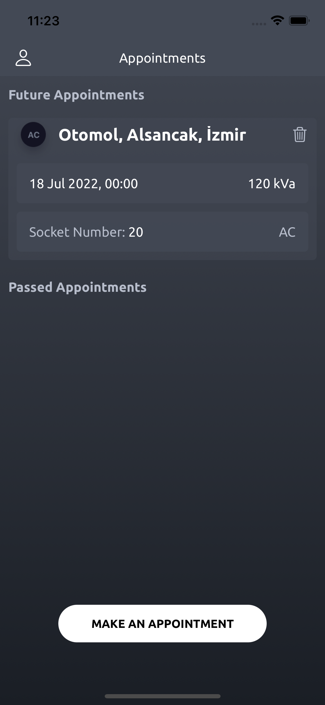 
  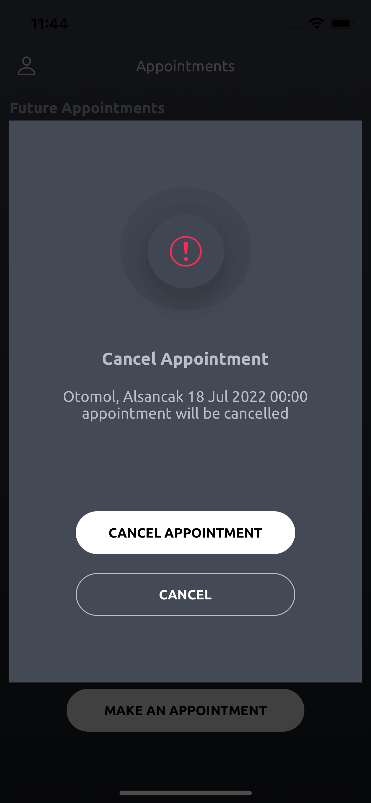 

### Cities View

When user taps on Make An Appointment button on Appointed Stations View, they are routed to Cities View. Users can search and select a city to appoint a station in. Search bar has 3 states: Idle, Found, Not Found. If there is a result for the search bar is highlighted with green color other wise with red color.

  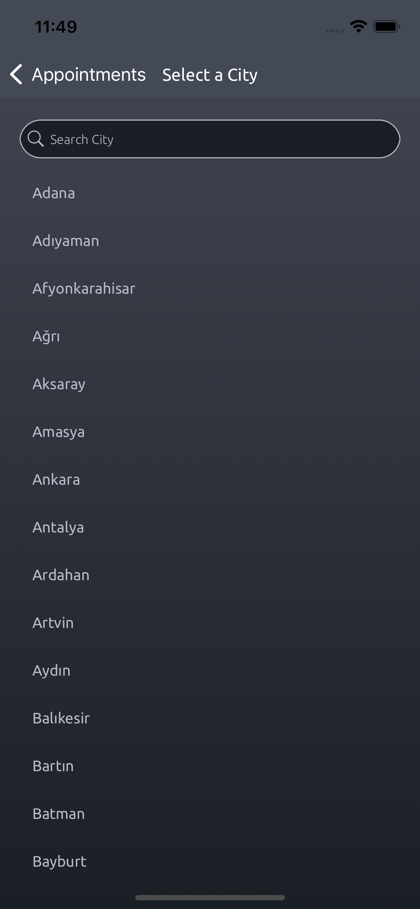 
   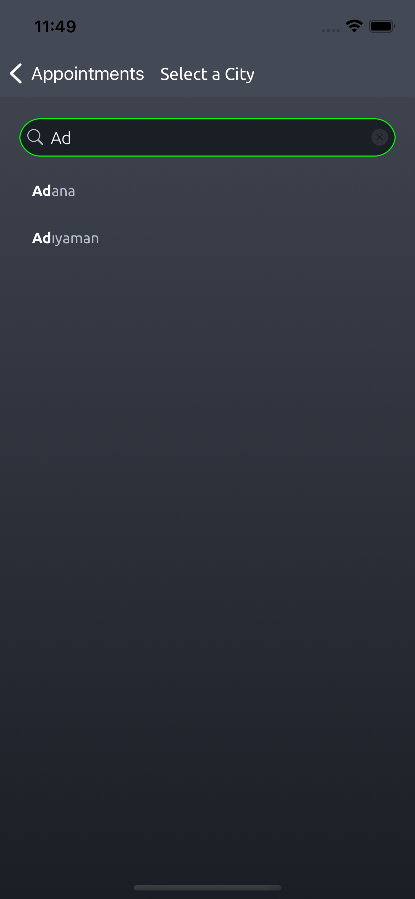 
  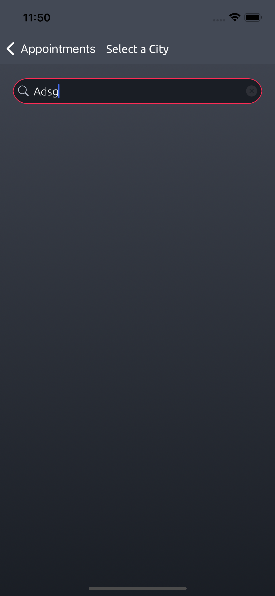 

### Station Selection View

Station in the city are displayed here, users can perform same search funcinality in Citeis View in here as well. User can choose filter button then get routed to filter view.

In filter view selected tags are routed back to stations view and stations that satisfies the tags are displayed on table view, selected tags displayed in a Horizontal Collection View under the search bar. Users can tab and this miss the tags on the collection view as well. 

  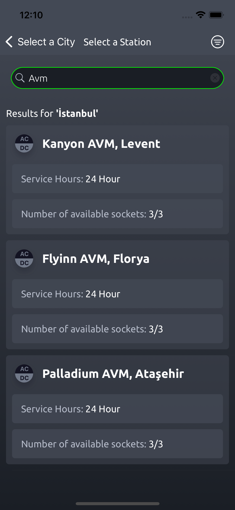 
   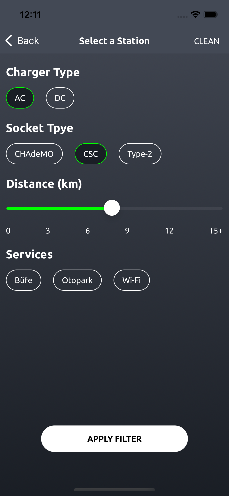 
  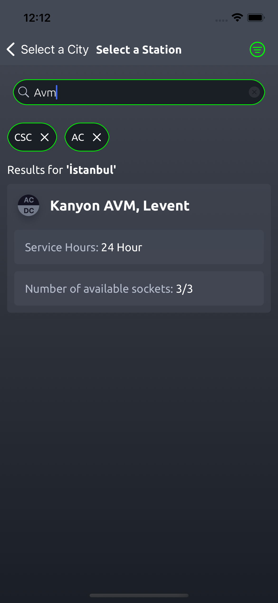 

### Date Selection View

Users can select an available date for the station selected. Users can tap on date and select a date on given date picker, if user selects a past date, a warning will appear and warning lets users either continue with current date or lets them selecte a new data. Available hours are listed for the sockets after data selected, if a hour is already accopied it will appear as gray.

  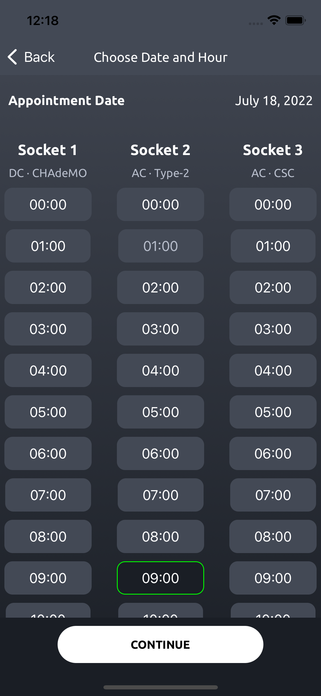 
   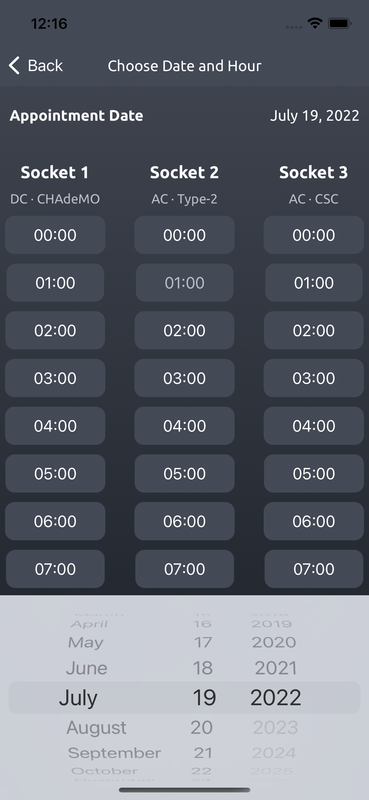 
  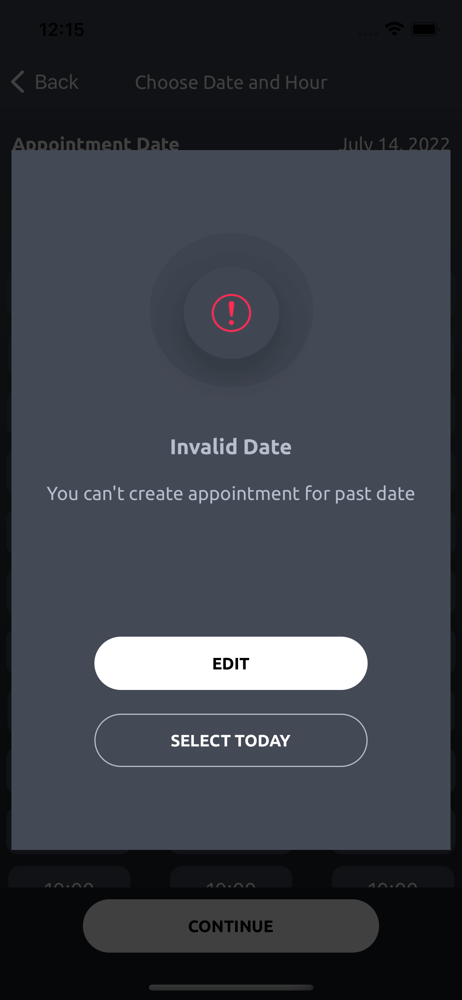 

### Appointment Details View

Users can see their appointment details as station, socket and appointment time. If user gave permssion for location info at the launch of app, distance to charger station is provided in the details. After confirmation users are routed to Appointed Stations View.

  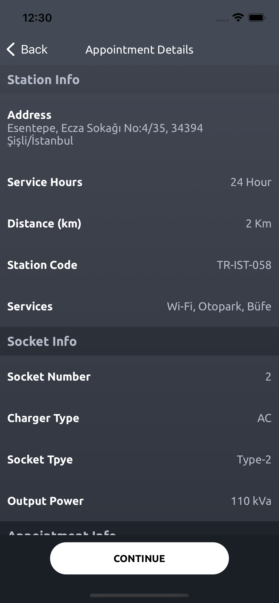  

